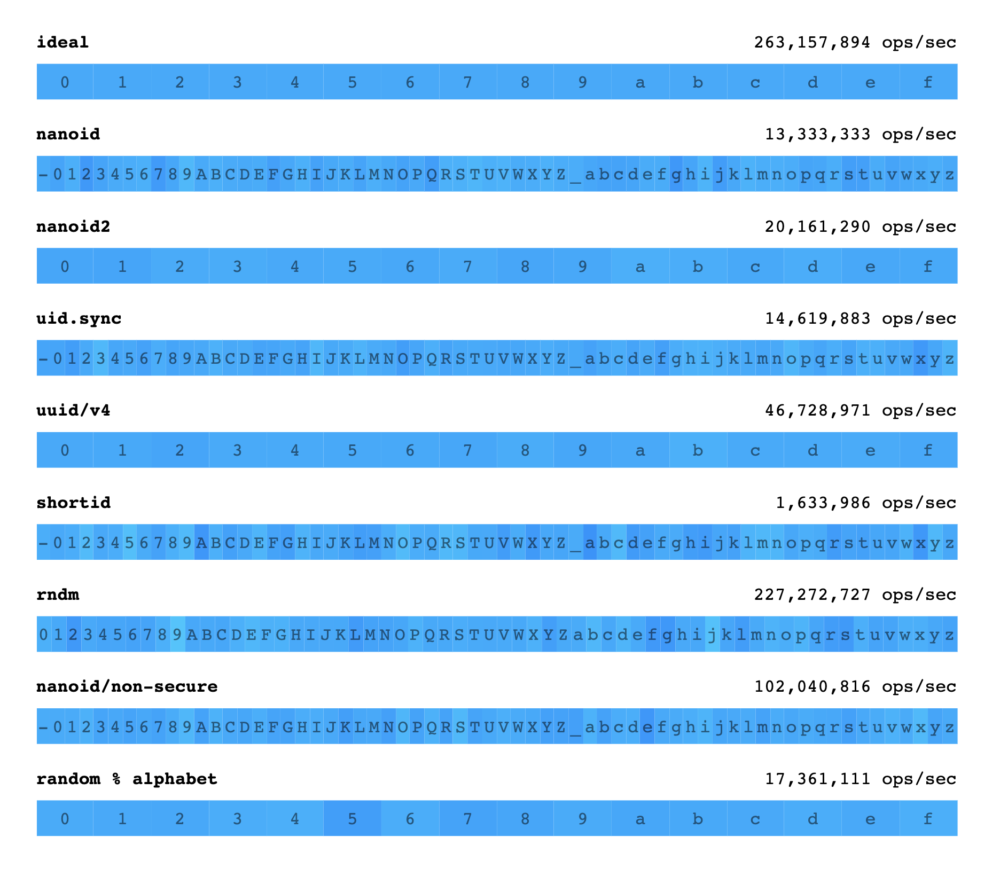

# nanoid 最好的 id 生成器？

在日常开发中，我们可能经常需要为某一个变量附上一个独特的标志来标记这个变量的独一无二性，可能会是 token，用户的 device id 等等。(当然把他用作 react 或 vue 在列表时渲染的 key，也没人拦着，毕竟他自己文档里就有写到这个应用场景)。作为目前调研到的比较好的 id 生成器(uuid 之类也不错),决定学习下其中的原理

## 性能分析与比较

首先可以来看一下 nanoid 和其他 id 生成器有关实际效果和性能的比较



色带的颜色分布代表不同基础字符的出现频次，也就是说整个色带的颜色越趋于一致，id 生成效果的随机性越好，可见 ideal 理想状态，在不考虑性能的情况下，达到的最好效果就是色带只有一种颜色。

右上侧则是比较了一下各种生成器的速度。

#### nanoid <-> rndm

色带效果差不多，性能上 nanoid 完胜，而且 rndm 体积较大(高达 35.4k),所以 rndm 不用想了

#### nanoid2 <-> uuid/v4

二者选用的基础字符一致，达到了同样效果的基础上，nanoid 只消耗了一半的性能，nanoid 胜

#### nanoid <-> shortid

目前来看 shortid 的执行速度是最优的，但是他不支持异步和生成指定长度 id 等功能，所以看实际情况比较，选择 nanoid 还是 shortid

## 实现原理

ok，接下来看下 nanoid 的代码是咋实现的。这里有两份实现: 一个是 node 环境的，一个是浏览器环境的。因为 node 环境可能用的会比较多，所以先看 node 环境

node 环境用到了[crypto 模块](https://www.liaoxuefeng.com/wiki/1022910821149312/1023025778520640)

在进入正题之前说下，在 js 的世界里只有字符串数据类型，没有二进制数据类型，但是在处理流的时候，这种数据类型必不可少。于是就出现了 buffer 来存储二进制数据。(但不意味着 buffer 本身是二进制的)

**先是默认的 random 函数**

```js
// 设置一个生成过的buffers的缓存，如果已经在某个位置生成过buffer，就不重新申请空间而是直接刷新内容
let buffers = {};
let random = (bytes) => {
  let buffer = buffers[bytes];
  if (!buffer) {
    // 因为这里只是纯粹地申请空间，所以用`Buffer.allocUnsafe()` 来提高性能
    buffer = Buffer.allocUnsafe(bytes);
    // 这句只存到255个，不太明白他的意图
    if (bytes <= 255) buffers[bytes] = buffer;
  }
  return crypto.randomFillSync(buffer);
};
```

**然后主调用其实非常的简单**

```js
let nanoid = (size = 21) => {
  // 先生成一个全随机的buffer
  let bytes = random(size);
  let id = '';
  while (size--) {
    /*
      举个例子说buffer `<Buffer 54 a6 4f bb fc 5c 29 f2 c0 18 07 da db 62 4a 24>`每个值的范围都是0-255.
      &63的操作的意思是把0-255的值映射进0-63，因为与操作比63最高位高的运算结果全是0，比最高位低的运算结果最高只为1，但往往不能把0-63每个值都映射到(也没必要).
    */
    id += urlAlphabet[bytes[size] & 63];
  }
  return id;
};
```

## 从中可以学会的技巧

```js
buffer直接转数组;
let crypto = require('crypto');
const ALPHABET = '0123456789abcdef';
const LENGTH = ALPHABET.length;

let buffers = {};

let random = (bytes) => {
  let buffer = buffers[bytes];
  if (!buffer) {
    // `Buffer.allocUnsafe()` is faster because it doesn’t flush the memory.
    // Memory flushing is unnecessary since the buffer allocation itself resets
    // the memory with the new bytes.
    buffer = Buffer.allocUnsafe(bytes);
    if (bytes <= 255) buffers[bytes] = buffer;
  }
  return crypto.randomFillSync(buffer);
};

console.log('random(LENGTH)', random(LENGTH), [...random(LENGTH)]);
```
